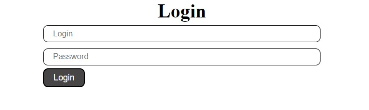
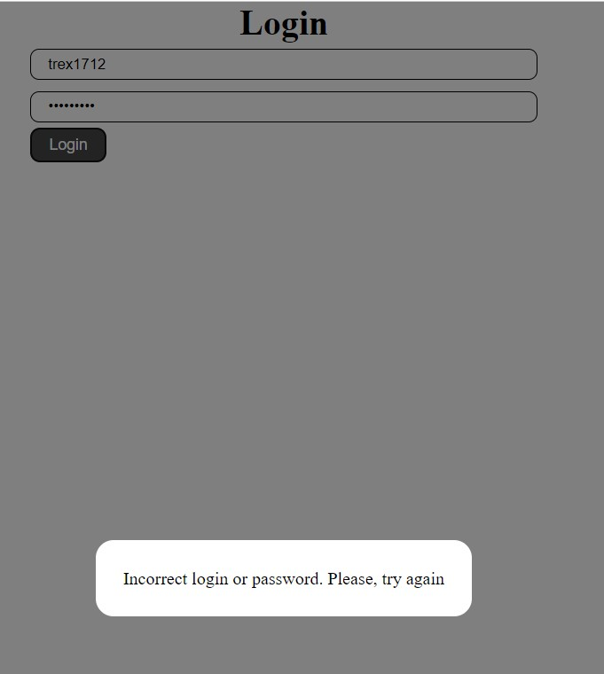
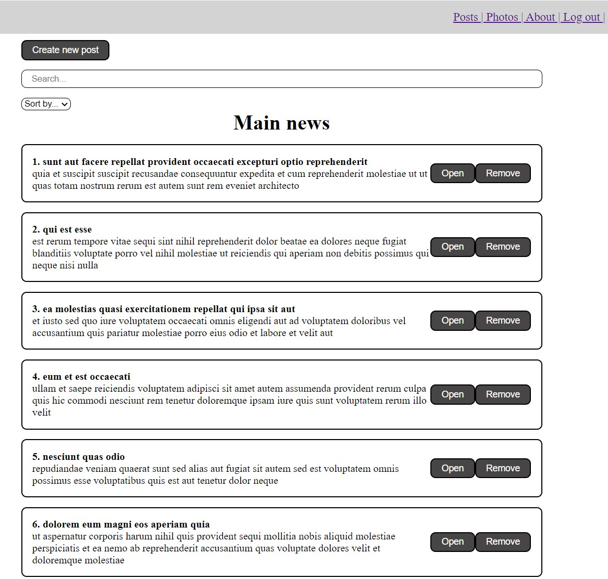
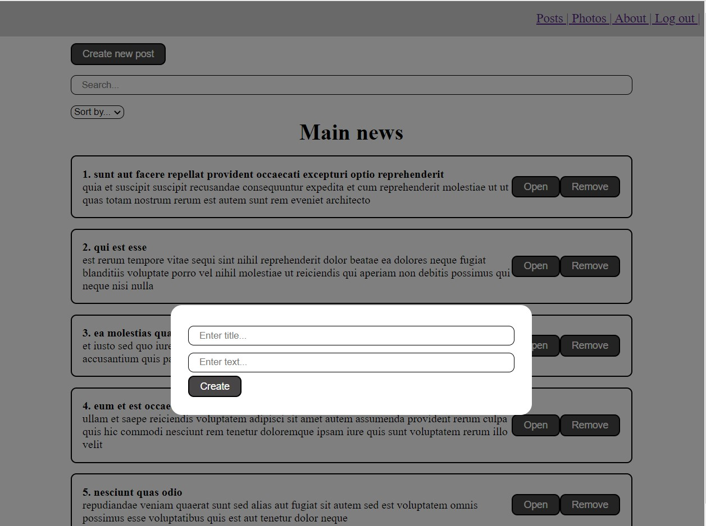
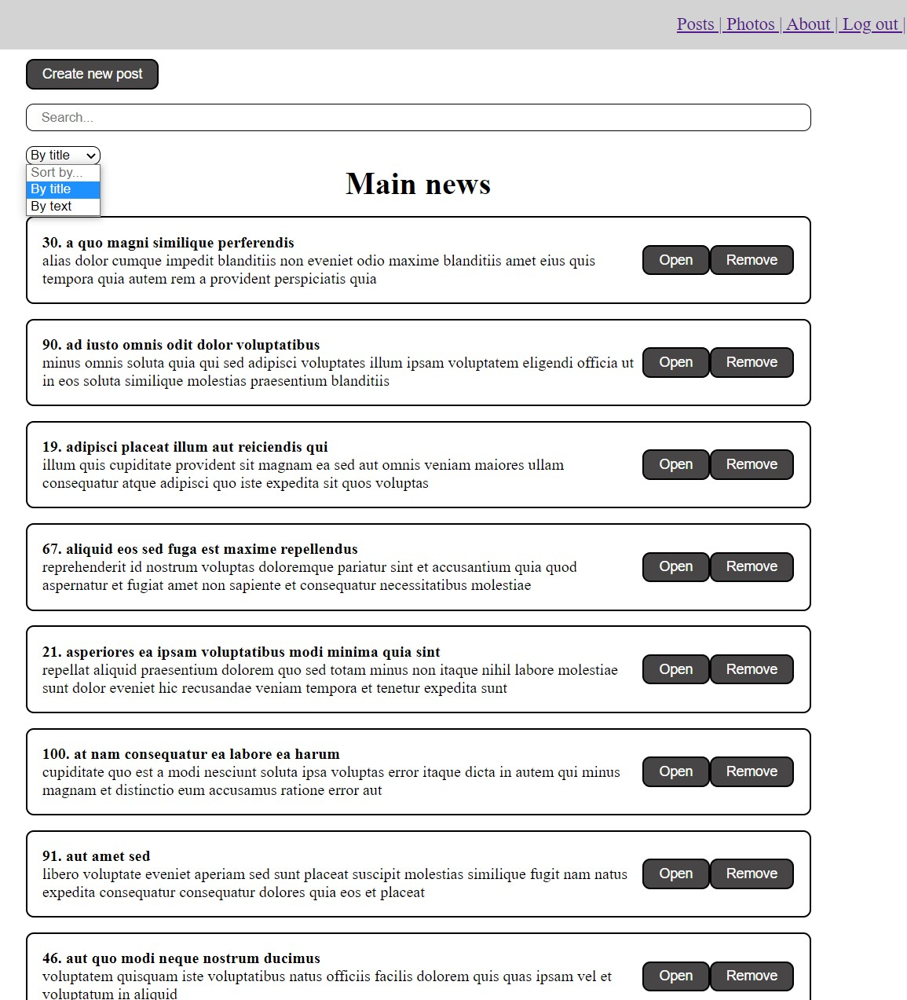
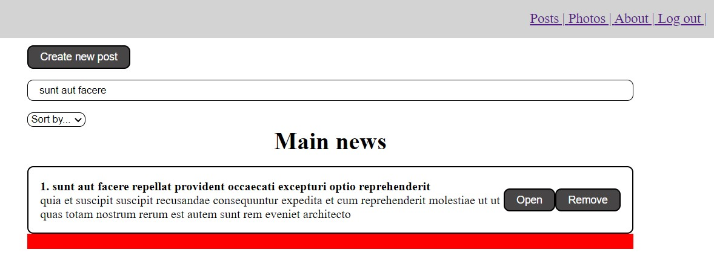
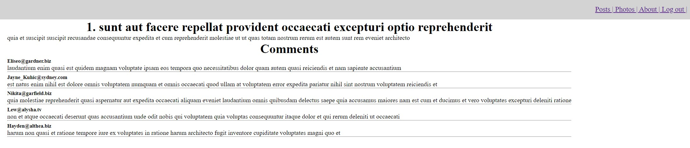
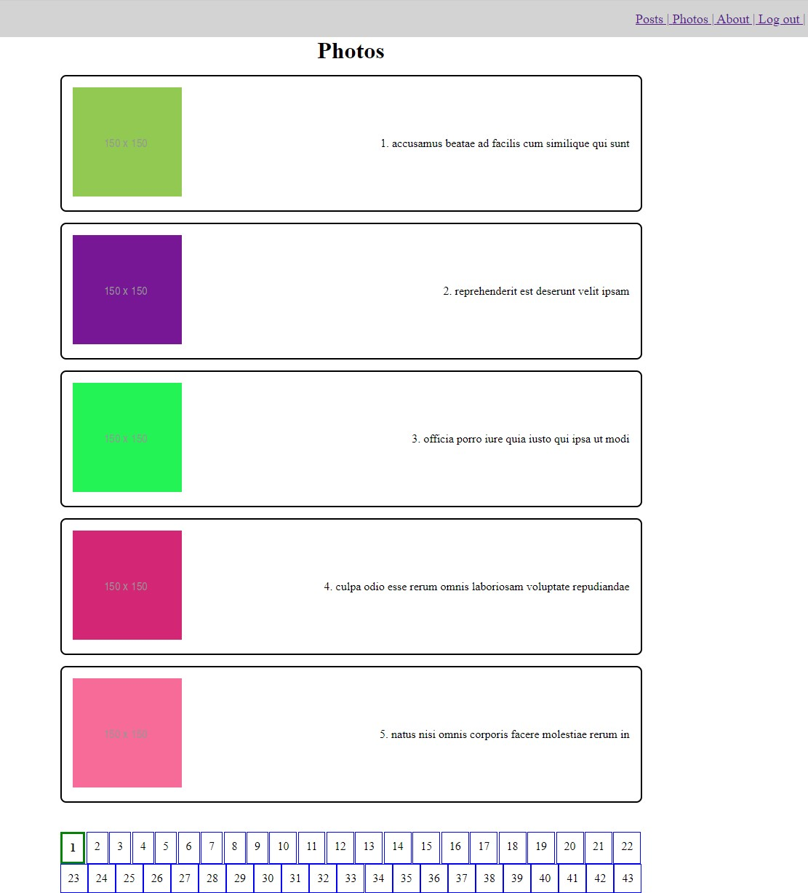
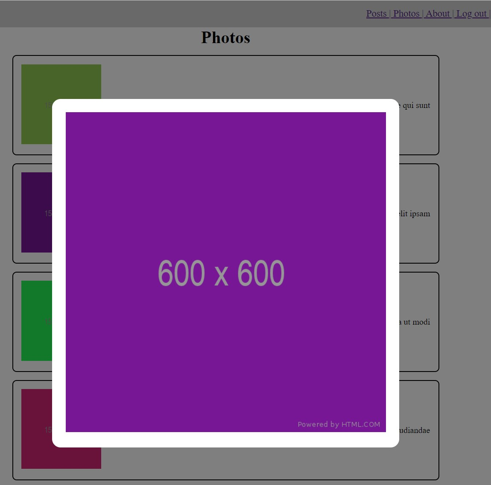
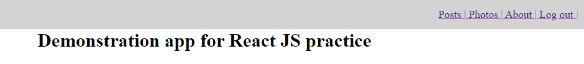

# Investing-blog

Simple React JS application for practice. [not about beauty, but about functionality :)]

After launching the application, an authorization form opens.

 

In case of incorrect password modal window appears.

 

After authorization, posts tab opens. There is a navbar on right top.
There is ability to create new post, sort by title and text, search by title or text.
Posts are loaded with a twist of 10 pieces.

 

After click "Create new post" form in modal window appears.
Enter data, click "Create" button and your post will apeear in list of posts.

 

Select type of sort and posts will be sorted.

 

Enter search query to Search input and corresponding posts will be appeared.

 

After click on "Remove" button, post will be removed from list.
After click on "Open" button corresponding post page opens.
Also post has comments.

 

After click on "Photos" tab on navbar Photos page opens.
The page has pagination.

 

After click on thumbnail modal window with big image appears.

 

Just "About" page.

 

After click "Logout" option on navbar, the user will return to the login page.

 

As datasource (API) https://jsonplaceholder.typicode.com was used.